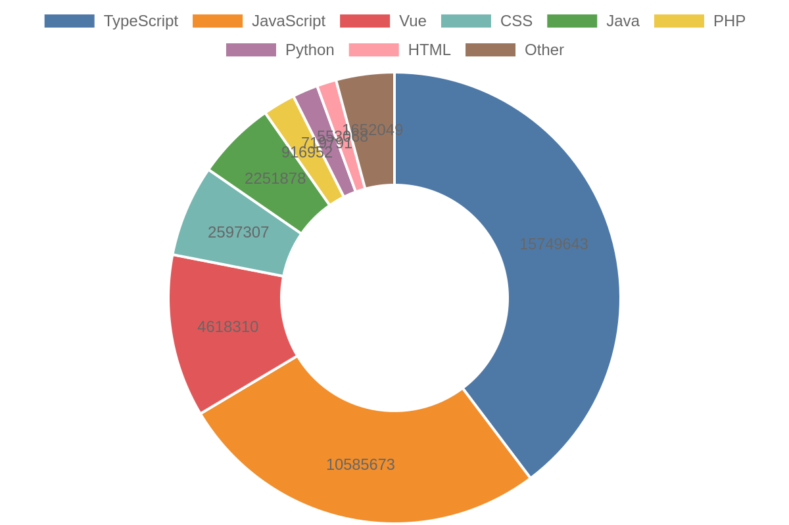
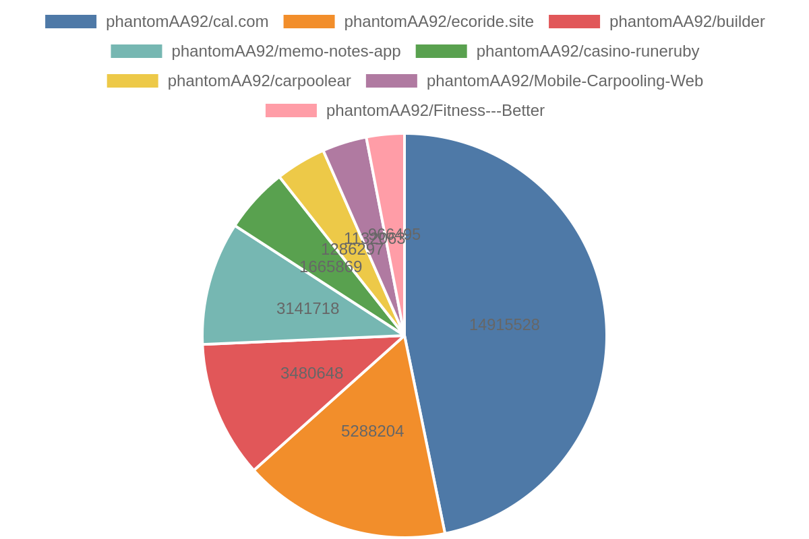

  

# Hello everyone 👋, I'm a Senior Full Stack Developer.

- 🔭 I’m currently working on **Advancing my Skills with Languages and tools**
- 🌱 I’m currently learning **AI Engineering**
- 👯 I’m looking to collaborate on **Open source projects**
- 💬 Ask me about **JavaScript, React.js, Web Development, Mobile App Development, etc...**

## 🛠️ Web Tech Stacks

  
  
  
  
  
  
  
  

## 📱 Mobile Tech Stacks

  
  
  
  

## 📊 Project & Repo Stats

  <!-- Generated charts: languages donut & top repos pie -->
  
  
   
  <!-- fallback: keep existing GitHub Readme Stats cards for quick glance -->
  
  

## 🏆 Top Star-Earning Project

  <!-- Replace the repo below if a different project should be highlighted -->
  

